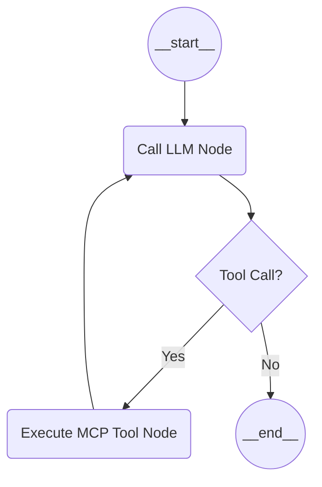

# LangGraph Basics

LangGraph is a library for building stateful, multi-actor applications with LLMs. It lets you create graphs (cycles) to define complex agent flows.

## Analogy

Think of an agent as a chef in a kitchen.

- The **State** is the recipe and the ingredients on the counter. Everyone reads from it and adds to it.
- A **Node** is a specific station (e.g., chopping station, cooking station).
- An **Edge** is the instructions (or logic) moving the chef from one station to another.
- The **LLM** is the chef deciding what to do next based on the ingredients (State).

## Key Concepts

### 1. StateMap (StateGraph)

A `StateGraph` object defines the state. We typically use a Typed interface or class. It acts as the "Memory" of a specific execution run.

```typescript
// Example: The chef's ingredients and logs of what was done
import { StateGraph, Annotation } from "@langchain/langgraph";

export const AgentState = Annotation.Root({
  messages: Annotation<BaseMessage[]>({
    reducer: (x, y) => x.concat(y), // How new messages merge into the state
    default: () => [],
  }),
});
```

### 2. Nodes

Functions that take the State as input and return updates to the State.

```typescript
const callModelNode = async (state: typeof AgentState.State) => {
  const response = await llm.invoke(state.messages);
  return { messages: [response] }; // Updates the state
};
```

### 3. Edges

Define the control flow. They can be straight paths or conditional routing.

```typescript
// Normal edge
graph.addEdge("nodeA", "nodeB");

// Conditional edge: "Should we use a tool or end?"
graph.addConditionalEdges("callModel", (state) => {
  if (state.messages[state.messages.length - 1].tool_calls?.length > 0) {
    return "tools";
  }
  return "__end__"; // Special end node
});
```

## Mermaid Representation


