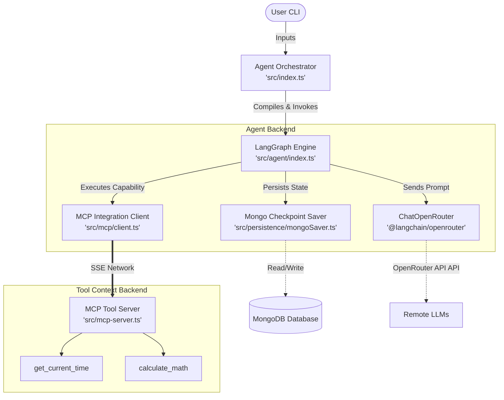
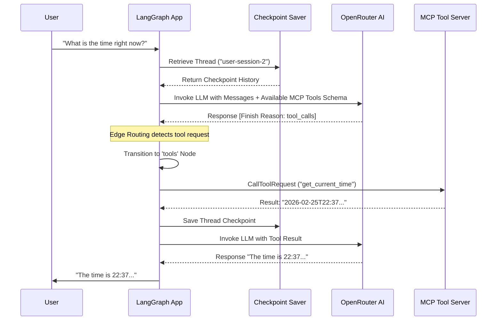
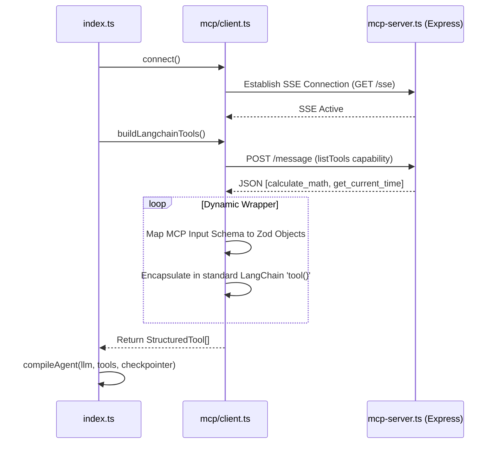

# System Architecture & Workflows

This document visualizes the high-level architecture mapped to our SOLID methodology, illustrating how the LangGraph conversational agent requests tools from the Express Model Context Protocol (MCP) server.

## 1. High-Level System Architecture

This diagram shows the complete boundary isolation between logical application modules.

## 2. Agent Execution Sequence

This sequence diagram depicts what happens when a User submits a prompt over the CLI that asks for specific tool-requiring information.

## 3. Tool Discovery and Initialization (Startup)

Before the agent can answer any questions, it must discover its capabilities at launch. This illustrates the initialization sequence mapping the MCP protocol to LangChain tools dynamically.

